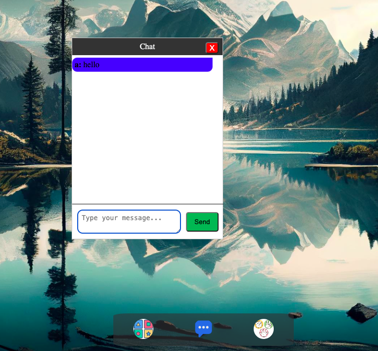

# A3 SPA
This application is a single page application, mimicing a simple desktop with three different applications.

**Starting point**

**Memory game**

**Chat**

**Rock Paper Scissors game**

**EXECUTE LINTERS**:
You can execute the linters by "npm run lint" or "npm run htmlhint", "npm run stylelint", "npm run eslint"

**Start the program**
Download the code and type this in the terminal "npm run dev" and enter the localhost ip into your webbrowser.

